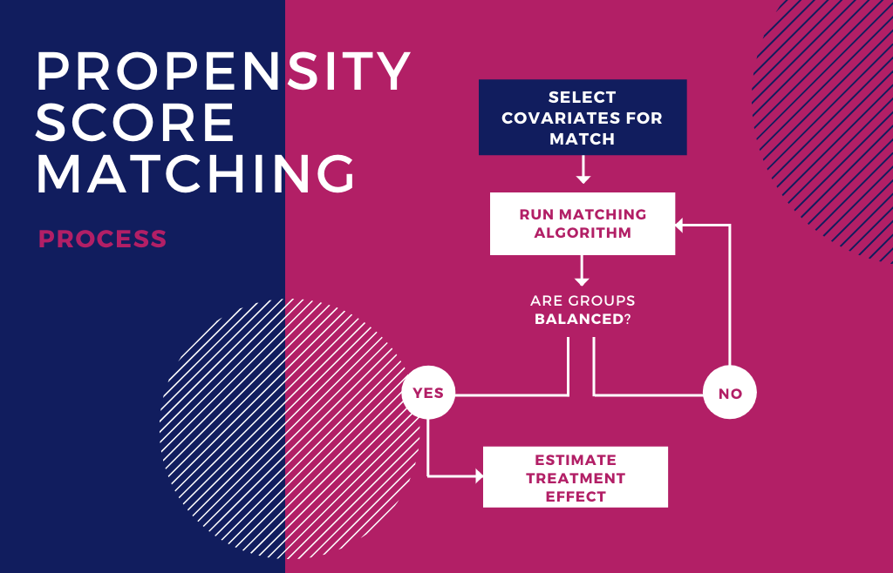

# Introduction

In this second report, we will demonstrate how to get started with matching methods using R and the [MatchIt](https://cran.r-project.org/web/packages/MatchIt/MatchIt.pdf) package.

> *"Matching is a nonparametric method of preprocessing data to control for some or all of the potentially confounding influence of pretreatment control variables by reducing imbalance between the treated and control groups. After preprocessing in this way, any method of analysis that would have been used without matching can be applied to estimate causal effects."*
**- [Gary King](http://gking.harvard.edu/cem)**

# Loading the data

To begin we need to load some data. We will use as example a data set previously analyzed extensively by [Lalonde (1986)](http://business.baylor.edu/scott_cunningham/teaching/lalonde-1986.pdf) and [Dehejia and Wahba (1999)](https://www.ics.uci.edu/~sternh/courses/265/dehejiawahba_jasa1999.pdf). In this data set, there is a subsample of the data from the treated group in the National Supported Work Demonstration (NSW) and the comparison sample from the Current Population Survey (CPS).

```{r message=FALSE, warning=FALSE, include=FALSE}
## Install packages

#install.packages("MatchIt")
#install.packages("optmatch")
#install.packages("RItools")
```

```{r message=FALSE, warning=FALSE, include=FALSE}
## Loading the needed libraries

library(kableExtra)      # help you build common complex tables and manipulate table styles
library(DataExplorer)    # automated data exploration
library(tidyverse)       # for general data wrangling (includes readr and dplyr)
library(ggplot2)         # to draw statistical plots 
library(MatchIt)
library(optmatch)
library(RItools)
library(ggthemes)
library(funModeling) 
```

```{r message=FALSE, warning=FALSE}
## Loading data: a subset of the LaLonde data is loaded with the MatchIt library

data(lalonde)
```

# Data Inspection

```{r echo=FALSE}
## Examine data briefly

kable(introduce(lalonde)) %>%
kable_styling(bootstrap_options = c("striped", "hover", "condensed"), full_width = F) %>%
scroll_box(width = "100%")
```

To perform matching methods, we will need a data set that consists of cases in rows and variables in columns. We will need a **dependent variable** and one or more matching variables. The dependent variable is the variable that specifies which group a case belongs to (e.g., treatment or control). In this example, our dependent variable is `treat`, where $1$ means treatment and $0$, control.

```{r message=FALSE, warning=FALSE}
## View LaLonde dataframe 

kable(head(lalonde, 10)) %>%
kable_styling(bootstrap_options = c("striped", "hover", "condensed"), full_width = F) %>%
scroll_box(width = "100%")
```

------

## Observations

* 614 observations: 185 treated, 429 control
* 10 variables measured for each individual:
  + Outcome (`re78`) = income in 1978, in U.S.
  + Treatment (`treat`) = participation in job training  (1 = treated, 0 = control)
  + Training Covariants: 
    - `age` is age in years
    - `educ` is education in number of years of schooling
    - `black` is an indicator for African-American (1 = African-American, 0 = not)
    - `hispan` is an indicator for being of Hispanic origin (1 = Hispanic, 0 = not)
    - `married` is an indicator for married (1 = married, 0 = not married)
    - `nodegree` is an indicator for whether the individual has a high school degree (1 = no degree, 0 = degree)
    - `re74` is income in 1974, in U.S. dollars
    - `re75` is income in 1975, in U.S. dollars

# Data Structure

```{r}
glimpse(lalonde)
```

```{r}
kable(df_status(lalonde, FALSE)) %>%
kable_styling(bootstrap_options = c("striped", "hover", "condensed"), full_width = F) %>%
scroll_box(width = "100%")
```

* Composition:

```{r}
f <- freq(lalonde$treat)
```

# Propensity Score Matching

In this tutorial we'll analyze the effect of participating in job training, as opposed to not participate, on income in 1978 dollars. We will use propensity score matching to get more credible causal estimates of job training.

To examine the effect of participating in job training ("Treated") versus non-participation ("Control") on income using matching we will go through the following steps:

1. Preliminary analysis
2. Estimation of Propensity scores (the probability of being Treated given a set of pre-treatment covariates)
3. Propensity Score matching. We'll use the following matching methods:
  a) Coarsened Exact Matching (CEM)
  b) Nearest neighbor matching
  c) Nearest neighbor matching, with Mahalanobis distance measure
4. Outcome analysis
5. Sensitivity analysis 

<center>

</center>

## Preliminary Analysis (using unmatched data)

Before propensity scores are calculated, it is a good practice to determine if the two groups are balanced. The best practice to determine the covariates that influence group assignment is based on theoretical evidence. In addition, statistical tests can also be used to determine if the covariates are imbalanced across groups. The package [RItools](https://cran.r-project.org/web/packages/RItools/index.html) includes the routine `XBalance` that estimates a chi-square test to which checks if there is at least one variable in the selection model for which the two groups are different. 

### Computing indices of covariate imbalance before matching

#### 1. Standardized difference

```{r}
treated <- (lalonde$treat==1)
cov <- lalonde[,2:9]
std.diff <- apply(cov,2,function(x) 100*(mean(x[treated])- mean(x[!treated]))/(sqrt(0.5*(var(x[treated]) + var(x[!treated])))))
sort(abs(std.diff))
```

For the standardized difference, absolute scores higher than $25%$ are considered suspect, and may indicate an imbalance for that specific variable [(Stuart & Rubin, 2008)](http://citeseerx.ist.psu.edu/viewdoc/download;jsessionid=F52F07E838B6B1B9DB8B05FB10AAE7CB?doi=10.1.1.584.1057&rep=rep1&type=pdf). That is, `hispan`, `re75`, `re74`, `married` and `black`.

#### 2. Check initial balance

* *How similar are treatment/control groups on X?*

```{r}
xBalance(treat ~ . - (re78 + treat), data=lalonde, report=c("all"))
```

A statistically significant chi-square will indicate that at least one of the variables included in the model is creating an imbalance between the two groups. Variables that create imbalance should be included in the selection model. Also as part of the preliminary analysis it is a good practice to assess the effects of the treatment on the outcome variable by running the outcome model. This assessment can be based on the treatment variable only (using a t-test), or include covariates (using a regression model).

### Treatment effect without matching: difference of means

```{r}
unmatched <- lm(re78 ~ treat, data=lalonde)
summary(unmatched)
```

```{r}
effect <- unmatched$coeff[2]
effect
```

### Treatment effect without matching: regression

```{r}
unmatched <- lm(re78 ~ treat + age + educ + nodegree + re74 + re75 + married + black + hispan, data = lalonde)
summary(unmatched)
```

## Propensity Score Estimation

Packages such as MatchIt estimates propensity scores using logistic regression as the default option. However, when estimating propensity scores using the default option, the fit of the model cannot be assessed. Therefore, it is recommended that a logistic regression is run to determine the model fit. 

### Calculates the propensity score

```{r}
ps <- glm(treat ~ age + educ + nodegree + re74 + re75, data=lalonde, family=binomial())
summary(ps)
```

Statistically significant estimates are identified by low (i.e., $< 0.05$) p-values. There are no clear suggestions as to whether to include in the final model all the variables (even non-significant). Some authors suggest that the final model should include not only statistically significant variables, but also variables known to be associated with selection.

Once the propensity scores have been calculated, a graphical approach can be used to assess the distributional similarity between score distributions. This graphical approach uses back to back histograms such as those created through the package Hmisc. Back to back histograms cannot be used with Mahalanobis distance, because it is a multidimensional technique. 

* Attach the predicted propensity score to the datafile

```{r}
lalonde$psvalue <- predict(ps, type="response")
```

### Back to back histogram

```{r fig.height=5, fig.width=10}
out <- histbackback(split(lalonde$psvalue, lalonde$treat), main="Propensity score before matching", xlab=c("control", "treatment"))
#! just adding color
barplot(-out$left, col="#111d5e" , horiz=TRUE, space=0, add=TRUE, axes=FALSE)
barplot(out$right, col="#b21f66", horiz=TRUE, space=0, add=TRUE, axes=FALSE)
```

Important parameters to determine the fit are not only the shape, but also degree of overlap between the two distributions (known as the common support region). Matching is best when there is a common support region.

## Propensity Score Matching

Packages such as MatchIt provide summary tables that include means and standard deviations for the two groups both before and after the matching was completed. It also includes percent improvement, and finally, it provides a summary of the number of individuals included in the final sample, and cases that were not matched. The number of matched and unmatched cases is usually dependent on the match ratio imposed by the user, and the number of cases in the treatment group.

### Match using Coarsened Exact Matching (CEM)

Coarsened Exact Matching (CEM) is a Monotonic Imbalance Bounding (MIB) matching method - which means that the balance between the treated and control groups is chosen by the user ex-ante rather than discovered through the usual laborious process of checking after the fact and repeatedly reestimating, and so that adjusting the imbalance on one variable has no effect on the maximum imbalance of any other. CEM also strictly bounds through ex-ante user choice both the degree of model dependence and the average treatment effect estimation error, eliminates the need for a separate procedure to restrict data to common empirical support, meets the congruence principle, is robust to measurement error, works well with multiple imputation methods for missing data, and is extremely fast computationally even with very large data sets. CEM also works well for multicategory treatments, determining blocks in experimental designs, and evaluating extreme counterfactuals.

```{r}
m.cem <- matchit(treat ~ age + educ + nodegree + re74 + re75, data=lalonde, method="cem")
summary(m.cem)
match.data.1 = match.data(m.cem)
```

### Match using Nearest neighbor matching

Nearest neighbor matching selects the $r$ (default=1) best control matches for each individual in the treatment group (excluding those discarded using the `discard` option). Matching is done using a distance measure specified by the `distance` option (default=logit). Matches are chosen for each treated unit one at a time, with the order specified by the `m.order` command (default=largest to smallest). At each matching step, we choose the control unit that is not yet matched but is closest to the treated unit on the distance measure.

```{r}
m.nn <- matchit(treat ~ age + educ + nodegree + re74 + re75, data=lalonde, method="nearest", ratio = 1)
summary(m.nn)
match.data.2 = match.data(m.nn)
```

### Match using Nearest neighbor matching, with Mahalanobis distance measure

```{r}
m.nnm <- matchit(treat ~ age + educ + nodegree + re74 + re75, data=lalonde, method="nearest", ratio=1, distance="mahalanobis")
summary(m.nnm)
match.data.3 = match.data(m.nnm)
```


Graphical approaches (such as the jitter type in the package MatchIt), will help the user get some idea of whether the individuals not matched are in some specific part of the propensity-score continuum. The jitter plot shows the overall distribution of propensity scores in the treated and control groups.


```{r fig.height=5, fig.width=10}
plot(m.cem, type = "jitter", col = "#111d5e")
plot(m.nn, type = "jitter", col = "#111d5e")
#plot(m.nnm, type = "jitter", col = "#111d5e") ## Not appropriate for pure Mahalanobis matching. No plots generated.
```

As can be observed in this figure, the section labeled "Unmatched control Units" shows that most of the non-matched individuals were in the lower (0.0 to 0.4) part of the propensity scores. However, there were a few cases in a higher range (0.5-0.6).

It is important to determine that the groups are balanced, thus eliminating (or substantially reducing) the initial selection bias. In step 1 in this section (preliminary analysis) it was mentioned that there are both statistical as well as graphical approaches that can be used to determine the degree of imbalance. After the match has been conducted, both techniques are used again to determine that all the critical variables have been balanced. 


### Computing indices of covariate imbalance after matching

```{r}
### 1. Standardized difference
treated1 <- (match.data.2$treat==1)
cov1 <- match.data.2[,2:9]
std.diff1 <- apply(cov1,2,function(x) 100*(mean(x[treated1])- mean(x[!treated1]))/(sqrt(0.5*(var(x[treated1]) + var(x[!treated1])))))
abs(std.diff1)
```

```{r}
### 2. chi-square test
xBalance(treat ~ age + educ + nodegree + re74 + re75, data = match.data.2, report = c("chisquare.test"))
```

Although the chi-square test indicates no significance, thus suggesting equivalence between the groups, the standardized difference test shows that there are some variables with a large difference (i.e., black, hispan, married) that can still be improved. Potential suggestions might include the use of interactions terms, or polynomial terms to try to reduce their imbalance. A graphical approach that can be used to determine the match between groups is the back to back histograms. 

```{r fig.height=5, fig.width=10}
out <- histbackback(split(match.data.1$psvalue, match.data.1$treat), main= "Propensity score after matching (CEM)", xlab=c("control", "treatment"))
barplot(-out$left, col="#111d5e" , horiz=TRUE, space=0, add=TRUE, axes=FALSE)
barplot(out$right, col="#b21f66", horiz=TRUE, space=0, add=TRUE, axes=FALSE)
```


```{r fig.height=5, fig.width=10}
out <- histbackback(split(match.data.2$psvalue, match.data.2$treat), main= "Propensity score after matching (NN)", xlab=c("control", "treatment"))
barplot(-out$left, col="#111d5e" , horiz=TRUE, space=0, add=TRUE, axes=FALSE)
barplot(out$right, col="#b21f66", horiz=TRUE, space=0, add=TRUE, axes=FALSE)
```

```{r fig.height=5, fig.width=10}
out <- histbackback(split(match.data.3$psvalue, match.data.3$treat), main= "Propensity score after matching (NN w/ Mahalanobis)", xlab=c("control", "treatment"))
barplot(-out$left, col="#111d5e" , horiz=TRUE, space=0, add=TRUE, axes=FALSE)
barplot(out$right, col="#b21f66", horiz=TRUE, space=0, add=TRUE, axes=FALSE)
```

As can be observed above, there is a remarkable improvement in the match between the two distributions of propensity scores after the match (compared to the histograms for the same data before the match). This match suggests that the two groups are much more similar in terms of their propensity scores, and thus, the selection bias has been reduced substantially. 

## Outcomes Analysis

Once the researcher is satisfied with the propensity score matching, it is time to proceed with the outcome model. Several of the more frequently used techniques such as near neighbor, and Mahalanobis distances, can be used with analytic techniques such as linear regression models, ANCOVA, or even matched t-tests. However, the selection of any analytic approach to estimate the treatment effect and statistical significance should take into account the fact that the propensity score creates matched samples.

### Outcome analysis using paired t-test

```{r}
# saving the data matched
matches <- data.frame(m.nn$match.matrix)

# finding the matches. one for group 1 one for group 2
group1 <- match(row.names(matches), row.names(match.data.2))
group2 <- match(matches$X1, row.names(match.data.2))

# extracting the outcome value for the matches
yT  <- match.data.2$re78[group1]
yC  <- match.data.2$re78[group2]

# binding
matched.cases <- cbind(matches, yT, yC)

#Paired t-test
t.test(matched.cases$yT, matched.cases$yC, paired = TRUE)
```

The simplicity of these outcomes analysis make them easy to complete and their implications are usually easy to understand. For optimal and full matching however, the outcome analyses are more complex. Under optimal and full matching, it is possible to have the same individual matched against more than one individual from the other group. And for full matching, this can be the case not only for individuals in the control group, but also for individuals in the treatment group. Given that individuals can be used more than once in both the treatment and control groups, multivariate techniques should not be used. 